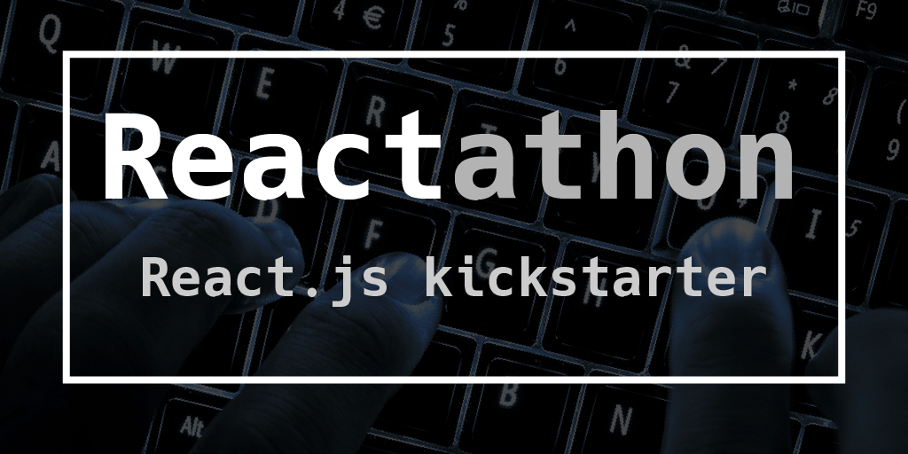

###  Deployment ready boilerplate using React, Relay, React-Router, Express and Passport.

This repo is designed to work out of the box so you can kickstart your next project.

> Inspired by [Hackathon Starter](https://github.com/sahat/hackathon-starter)
by [Sahat Yalkabov](https://github.com/sahat)

<p align="center">
  
  :wavy_dash: React.js :wavy_dash: Relay.js :wavy_dash: React-Router :wavy_dash: React-Bootstrap :wavy_dash:<br />
  :wavy_dash: GraphQL :wavy_dash: Sequelize (SQL) :wavy_dash: Express.js :wavy_dash: Passport.js :wavy_dash: Babel.js :wavy_dash: Winston :wavy_dash:<br />
  :wavy_dash: PM2 :wavy_dash: Microsoft Azure :wavy_dash: Heroku :wavy_dash:
</p>

### Philosophy

This should work out of the box without any issues.

### Rapid start
> For more info see [Getting Started](#getting-started)


```sh
  git clone https://github.com/MattMcFarland/reactathon.git &&
  cd reactathon && npm install && npm run dev
```
### Under active development

#### Current Roadmap:

[Current tasks and TODOS are using the issues board](https://github.com/MattMcFarland/reactathon/labels/TODO). This is more of a highlevel view of the project.
The following will be completed for the v1.0.0 release. we will be using SEMVER.

- [ ] Add an optional seeder that seeds the database with dummy data.
- [x] Add user profile page, dashboard page, and email support.
- [x] Add passport reset and passport forgot workflows.
- [ ] Add User posts and user follow actions / activities.
- [ ] Need a working unit test framework for clientside.


### A React-App on steroids

This is to serve as a starting point for those who want to rapidly build and
deploy an SEO-Ready WebApp with User Authentication and oAuth2 support
using React, Relay, React-Router, Express, and much more!

__Warning__:  Some of this boilerplate includes *experimental* technology,
so use at your own risk.

### Getting started

**.1 - Clone the Repo:**

```sh
git clone https://github.com/MattMcFarland/reactathon.git myApp
```

**.2 - Install Dependencies:**

```sh
npm install
```

**.3 - Edit App config**

Edit `server/src/app.config.js` to setup everything.

**.4 - Seed database**

Optionally run the seeder to create dummy data.

```sh
npm run seed
```

**.5 - Run the dev server**

```sh
npm run dev
```

**.6 - Deploy when ready**

Deploy options are further down the guide :)

### Tested System Requirements
- Mac OSX or Linux
- Node.js v5.3.0
- Further testing needed to source our requirements

### Reactathon bells and whistles include:

- React.js
- Node.js
- Express.js
- Babel.js 6.3.x ES7 Stage 0
- GraphQL
- Relay ready
- Sequelize SQL ORM
- sqlite3 database
- PhantomJS SEO
- Passport.js with oAuth2 support
  - SQL User database
  - Github
  - Facebook
  - Twitter
  - Google Plus
- Deployment with the following suites:
  - PM2
  - Microsoft Azure
  - Heroku
- Winston logging


### Changelog

- 0.9.0  (in progress)
  - Add database seeder (Issue: #6)
  - Add article list view (Issue: #3)
  - Add article detail view (Issue #20)

- 0.8.1
  - Update readme

- 0.8.0

  - Add Password reset views
  - Add Password reset endpoint
  - Add mailgun emailer
  - Add server endpoint for reset/forgot

- 0.7.0

  - Add winston logger

- 0.6.x
  - 0.6.2 - Fix issue #16 (Slow dev startup)
  - 0.6.1 - update ecosystem.json to have correct value for development env
  - 0.6.0 - add link/unlink social provider functionality to the dashboard view

- 0.5.0
  - add start of user dashboard
  - add edge cases for signup and logout
  - add oauth for github, google, twitter, and facebook.
  - fix critical issue with missing files causing npm install to fail.

- 0.4.x
  - 0.4.1 - Fix relayJS
  - 0.4.0 - Add Github oauth2 flow

- 0.3.0
  - Added social media button styling
  - Added client auth login logic

- 0.2.0
  - added adobe illustrator file

- 0.1.0

  - Fixed critical issue with example env vars not loading
  - Improved watch script speed
  - Add Token to model

- 0.0.0 -- start

### License

The MIT License

### Acknowledgements

The codebase is heavily inspired from [Hackathon Starter](https://github.com/sahat/hackathon-starter).
[Hackathon Starter](https://github.com/sahat/hackathon-starter) was created by Sahat Yalkabov in 2014 and is still very much in active development.


